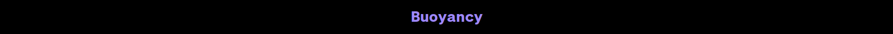
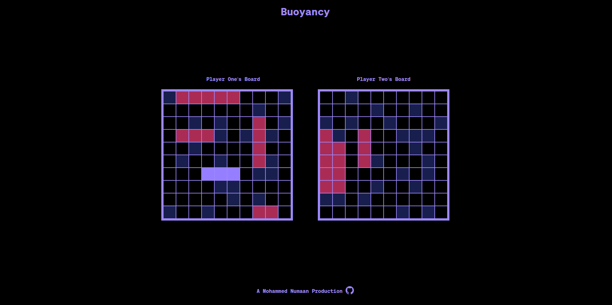
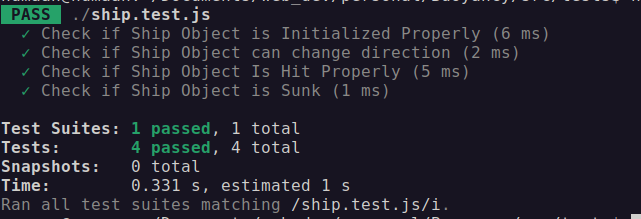
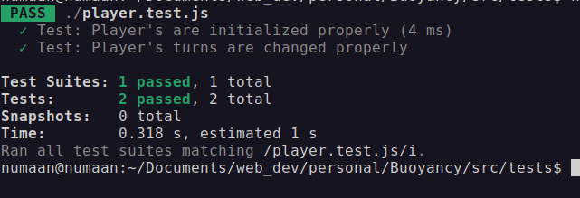
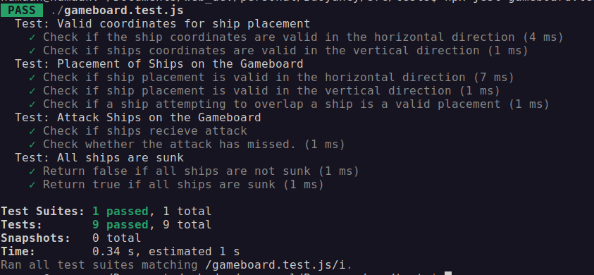
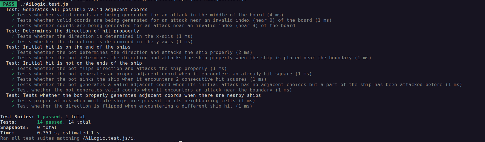
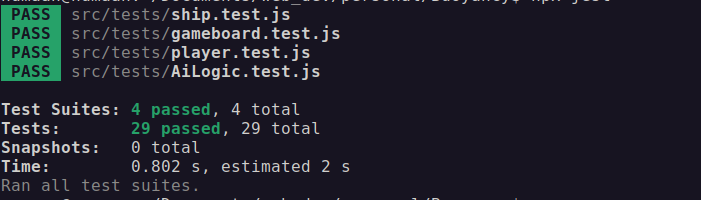
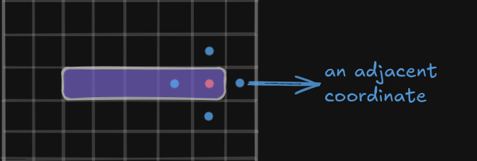
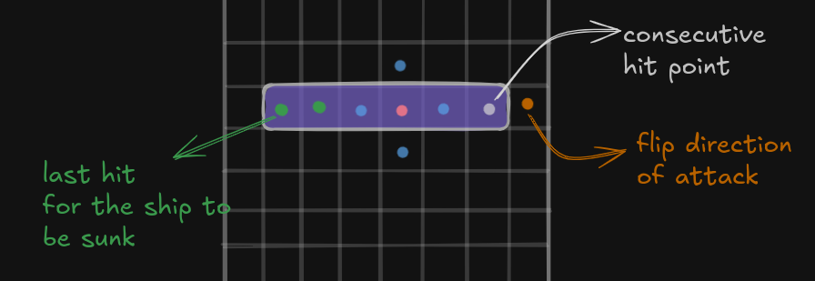
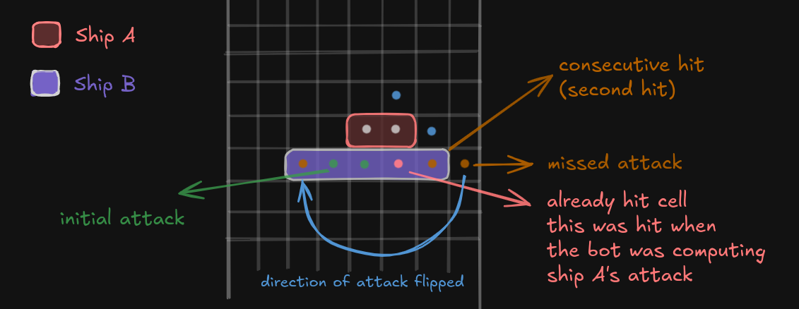

# Buoyancy: A Strategic Naval Warfare Game.


Buoyancy is a two-player strategy game where players place their ships on their respective boards. Players take turns guessing the coordinates of the opponent's ships, aiming to "hit" and sink them all. The first player to sink all of the opponent's ships wins the game.




## Features

- Designed an interactive and responsive User Interface.
- Implemented Drag-Drop to place ships on the board (for Desktop devices).
- Ability to play with both a Human player and an AI player.
- Designed an algorithm to allow the Bot/AI to make smarter moves on the board. [View More Details](#the-bot-algorithm).

## Tests

This project utilizes the *Jest Testing Framework* to perform **Unit Tests** on critical game components. The test files can be found [here](https://github.com/mohammednumaan/Buoyancy/tree/main/src/tests).

#### Ship Module Tests


#### Player Module Tests


#### Gameboard Module Tests


#### Ai Logic Module Tests


#### Overall Test Result


## The Bot Algorithm

This section is a quick overview of how the bot algorithm works. This can be divided into two different phases:

### Initial Phase 

In this phase, the bot generates a random valid coordinate. 
> The validity of the coord can be determined by whether the coord is  **out of bounds** or if its been **attcked previously**. If the generated coordinate is not out of bounds and is not attacked before, the coordinate is valid.

The bot then proceeds to attack the user's board with the generated coordinate.

This phase continues until the bot **hits** a ship on the board. ([Attack Phase](#attack-phase)).

## Attack Phase

When the bot finally hits a ship on the user's board, there are 3 possible scenarios that could happen:

#### 1. The initial hit is at the ends of the ship:

In this case, the logic is pretty straigtforward. The bot simply generates adjacent coordinates to the hit.




Consider the image above. The red point is the initial hit. The other marked blue points are the adjacent coordinates the bot will USE during its next attack. 

The bot selects a coordinate from these adjacent coordinates randomly until it finds a consecutive/valid hit of the **same** ship. Once it finds this next valid hit, it will compute the difference between the initial attack and the second hit (the valid hit) to determine the direction. Once it determines the direction, it will keep attacking in that direction until the ship is *sunk*.

> The adjacent points (blue-color points) shown doesn't show up in the game. Those points are visuals to show what adjacent coordinates the bot generates to understand the algorithm/logic better.

#### 2. The initial hit is not at the ends of the ship:



Consider the image above. The red-point is the initial attack. The bot proceeds to generate the adjacent coodinates with respect to the inital hit. Now, lets say the bot found the consecutive/second hit on the right side of its initial attack. It computes the direction and keeps attacking in that direction upto the **white** point as shown above. 

Now, the bot will attack the next coordinate (the **orange-point**). Since this point has no ship placed, the bot will **flip** the direction (i.e  **opposite** to its current **direction of attack**) and begin attacking in that direction as shown in the image (**green-points**).

The algorithm simply iterates the list of attacked coords backwards until it finds a **valid hit** ([View Definition](#initial-phase)) with the same ship as the current ship its attacking.

> It is guaranteed that the bot will flip the direction of attack at one point. 

### 3. The ship already contains a previous hit:

This case arises when the bot encounters an '**already hit cell**'. How does it encounter an already hit cell? Whouldn't it have sunk the ship when it first encountered it? To answer all these questions, lets take a more deeper look on how the bot algorithm works.

When the bot successfully guessed the consecutive hits of the ship, it keeps attacking that particular ship until its sunk. This means that, even if it hits a cell with a ship in it, **it checks whether the attacked ship is the same as the one it first attacked**. If it isn't the same ship, it stores that coordinate in a different array. So when it encounters a scenario like this one (i.e Case 3), it could use that stored coordinate to compute the next possible move.



Consider the image above. Lets assume the bot had attacked one of **Ship A's** cell at one point (`marked as a white point`). Now, lets also assume that, the next hit the bot chose was the cell below the initial attack of **Ship A**. Now, in this case, the bot would have checked if the attacked ship was the same as the ship in its initial attack.

In this case, it isn't. So, it tries calculating another adjacent coordinate until it finds the second and hit. 

Lets consider at some point in the game, the bot attacked **Ship B**. The initial attack is marked as a **green** point. Lets assume it chose the '**already hit cell**' (marked as `red` towards the right). It would then iteratively move in that direction until it finds a **valid** cell which contains the same ship.

If it doesn't find in that particular direction, it simply **flips** the direction of attack and proceeds to attack until the ship is sunk.

> Consecutive hits of a ship in this context means that, it guessed the second hit of the same ship to further determine the direction of attack and calculate the next possible attack in that direction . 

### Final Note

I hope this sections gives a very brief overview of how the algorithm works. There are a few more cases (`extension of case 3`) that is not covered in this section (this shouldn't matter a lot for now, since its an extension of `case-3`). To view the source code click [here](https://github.com/mohammednumaan/Buoyancy/blob/main/src/js/logic/AiLogic.js).


## Assets

### Fonts
- The font used in the project is called **Söhne**, which can be downloaded [here](https://befonts.com/sohne-font-family.html#google_vignette).
- For more details about the font, visit [here](https://klim.co.nz/retail-fonts/soehne/).

## Icons
- The browser tab icon for this project can be found [here](https://icons8.com/icons/set/sailing--purple).
- The Github icon (custom) used in the footer component of this project can be found [here](https://github.com/mohammednumaan/Buoyancy/blob/main/src/assets/github.png). 

All the assets can also be found [here](https://github.com/mohammednumaan/Buoyancy/blob/main/src/assets/github.png).


## Note

This project is a **major refactor** of the previous version of this game. The changes include: 

- New User Interface (responsive) and Color Theme.
- The entire `gameLogic` module and the core `DOM` functionalties implemented are asynchronous.
- Implemented features that allows a player to play a 2-player game with a person or with a smart AI/bot.

The older version of this game can be found [here](https://github.com/mohammednumaan/battleship). 
> Some viewports might have minor alignment issues. Additionally, running this application in certain browsers (Safari, DuckDuckGo) may cause some style issues.

```
Designed & Built By Mohammed Numaan.
```
